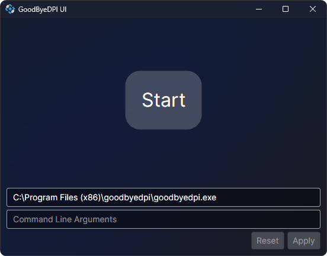
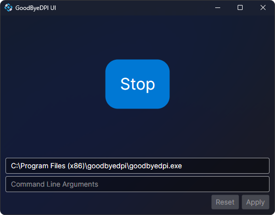

# GoodByeDPI UI
GoodByeDPI UI is a simple app that allows you to easily start and stop [GoodbyeDPI]([www.google.com](https://github.com/ValdikSS/GoodbyeDPI)) from its tray icon/window.

## Installation
1. Make sure you have [.NET 9.0](https://dotnet.microsoft.com/en-us/download/dotnet/9.0) installed
2. Download the latest release from [Releases](https://github.com/FawazTakahji/GoodByeDPI-UI/releases)
3. If you want to run the app at startup, you can do that using the task scheduler

## Command Line Arguments
These are the command line arguments that can be used when starting the ui app, these are not for GoodbyeDPI itself.
| Argument            | Description                                                        |
| ------------------- | ------------------------------------------------------------------ |
| `--auto-start`      | Automatically start the GoodbyeDPI executable at the provided path |
| `--start-minimized` | Start the app minimized to the tray                                |

## Screenshots

